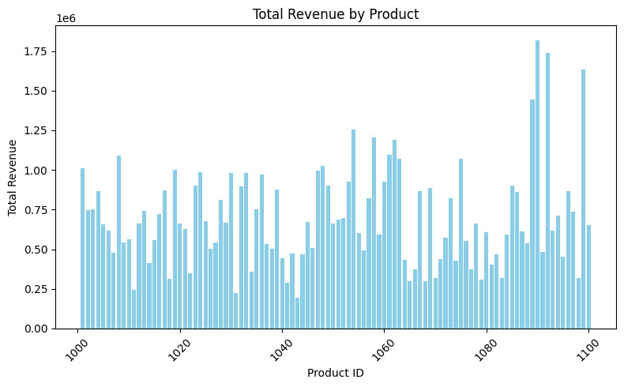

# Task 7: Basic Sales Summary using SQLite in Python

## Objective
Use SQL queries inside Python to summarize sales data (total quantity sold, total revenue) and visualize results with a bar chart.

## Tools Used
- Python (Google Colab)
- SQLite (`sqlite3`)
- Pandas
- Matplotlib

## Steps Taken
1. Uploaded existing cleaned sales dataset to Google Colab.
2. Loaded data into an in-memory SQLite database.
3. Ran SQL queries to calculate:
   - Total quantity sold per product
   - Total revenue per product
4. Displayed results using `print()` and visualized revenue by product using a bar chart.
5. Saved the bar chart as `sales_chart.png`.

## Outcome
Generated a table of sales summaries and a bar chart showing total revenue by product.

## Output Chart

